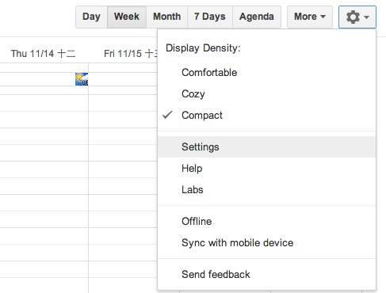
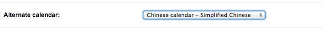
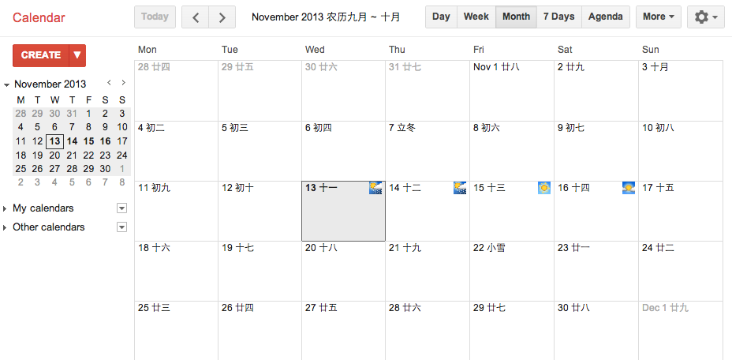
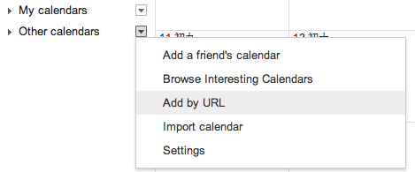
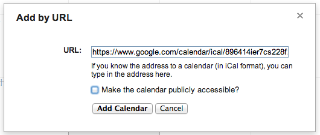

# 中国农历

- template: post.html
- pubdate: 2013-11-13
- tags: Calendar

----

Google 日历内置了中国农历的支持，但是各种桌面客户端如 Mac iCal, iPhone 默认日历
都无法正常使用，网上搜索了一遍也没有更好的订阅地址，大都不更新了。

而且我又不想装各种乱七八糟的第三方日历应用。

因此我自己制作了一个公开农历日历，需要的同学可以订阅到 Google Calendar，并且在
Google Calendar 中可以隐藏这个日历，只是在各个客户端中显示即可。

不过不爽的是，客户端不能针对特定日历设置提醒，有更好的方案的同学欢迎指教哈。

<!--more-->

## 启用 Google Calendar 内置农历（推荐）

1. 设置(Settings)

    

2. 基本(General)
3. 备用日历(Alternate calendar)

    

4. 选择 `农历 - 简体中文` (`Chinese calendar - Simplified Chinese`)
5. 保存(Save)
6. 最终可以在每日的日历顶部，有对应农历的显示。

    

----

Google 日历的这个特性真是太赞了，以前为每天创建一个全天日历的挫 B方案没脸比。

不过，现有的桌面（包括移动设备）应用中，都没能很好的支持这个特性。我又不想安装
第三方的乱七八糟的日历应用，希望一个日历应用管理所有的日历数据，希望数据是开放的。

因此挫 B 的方案只能继续。

通过互联网在整个世界找了一圈，分享出来的农历订阅日历都已经失效、或者不更新了，
因此我决定自己来维护世界和平，创建并分享了下面的中国农历，大家只需要订阅
到自己的日历中就可以了。

## 订阅地址

* [ical](https://www.google.com/calendar/ical/896414ier7cs228f2fp4mkn02g%40group.calendar.google.com/public/basic.ics)
* [xml](https://www.google.com/calendar/feeds/896414ier7cs228f2fp4mkn02g%40group.calendar.google.com/public/basic)
* [html](https://www.google.com/calendar/embed?src=896414ier7cs228f2fp4mkn02g%40group.calendar.google.com&ctz=Asia/Shanghai)

## 订阅方法

桌面应用本身支持直接订阅 ical 日历，但是为了便于管理，我统一使用了 Google Calendar
管理我的日历，桌面应用只是客户端，数据来源于 Google Calendar。

* Other calendars 右侧的菜单，选择 `Add by URL`

    

* 填入 ical 地址：

    `https://www.google.com/calendar/ical/896414ier7cs228f2fp4mkn02g%40group.calendar.google.com/public/basic.ics`

    

* 点击 Add Calendar 按钮。
* 由于 Google Calendar 本身内置了农历的支持，可以在 Google Calendar 中隐藏不显示这个日历。

预览：

<iframe src="https://www.google.com/calendar/embed?height=600&amp;wkst=1&amp;bgcolor=%23FFFFFF&amp;src=896414ier7cs228f2fp4mkn02g%40group.calendar.google.com&amp;color=%23875509&amp;ctz=Asia%2FShanghai"
  style=" border-width:0 " width="800" height="600" frameborder="0" scrolling="no"></iframe>

## 其他

* 如果在使用过程中发现其中的错误，请邮件给我。
* 同时欢迎 Fork 这个 [『中国农历』开放项目](https://github.com/hotoo/chinese-lunar-calendar) 。
    或者给我们提交 Issues。
