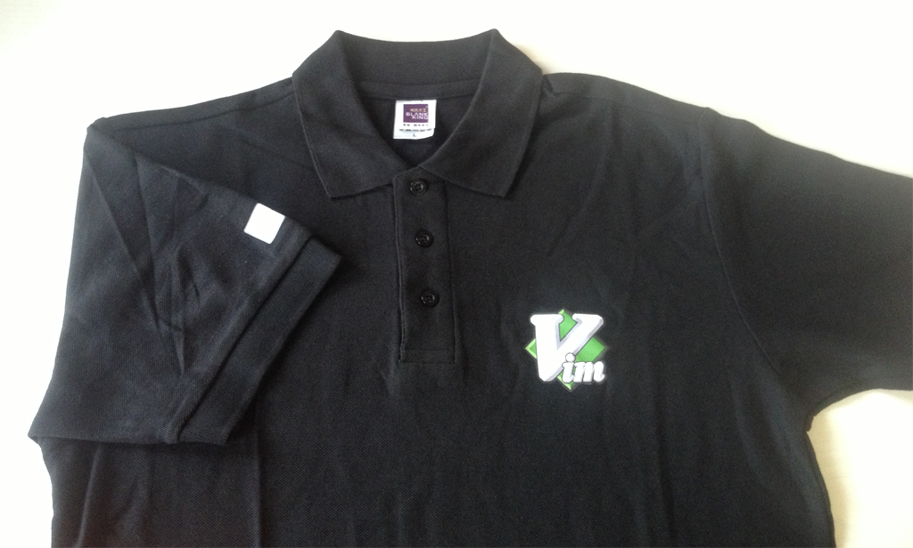
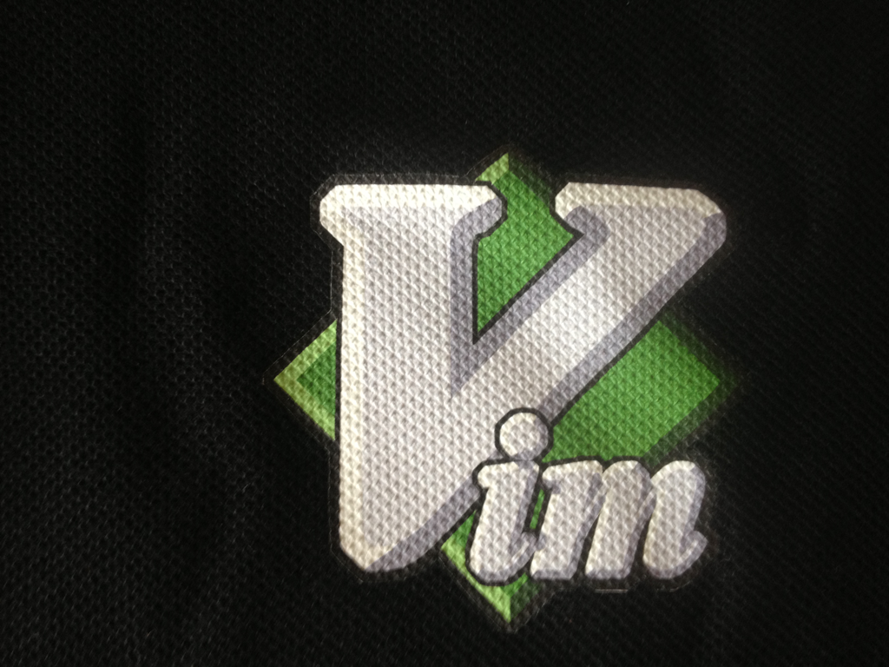
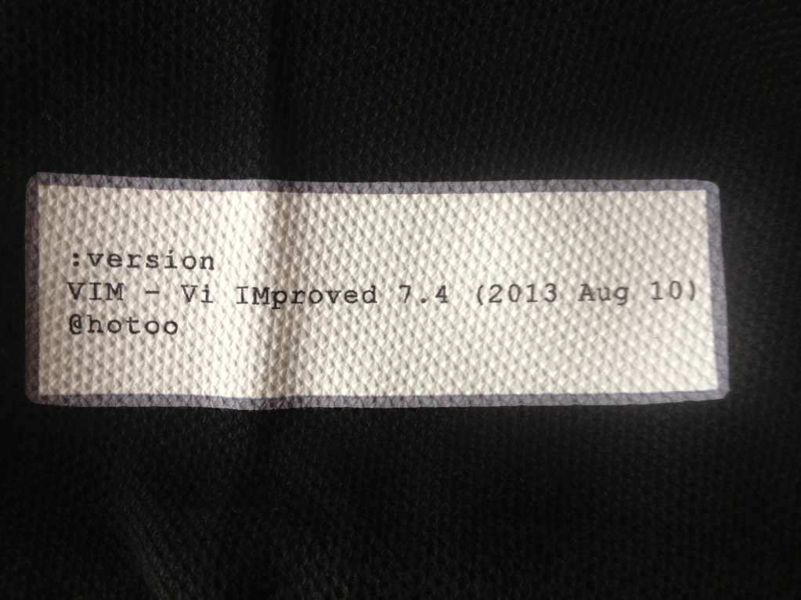

# 『已结束』庆祝 Vim 7.4 发布，发起团购 Tee + 团捐活动(2013)

- template: post.html
- pubdate: 2013-05-26
- tags: Vim, VimTee

----

> 团购活动已经结束，但你仍然可以自行印制或购买 
> 团捐活动已经结束，但你仍然可以 [自行捐助](http://www.vim.org/sponsor/index.php)

----

> 本次活动有 41人参加，团购 Tee 47件。 
> 最终以 [@vimcn](http://www.vim.org/account/profile.php?user_id=66604) 的身份
> 捐赠 159欧元，实际人民币 1377.94元。 
> 参加团捐的同学请查收邮件并于 2013年10月份之前行使您的 Vim 新特性赞同或反对票。

于 2013年08月10日发发布的 Vim 7.4 的主要特性更新如下：

1. 增强 Python 支持；
2. 内置更快的正则表达式引擎；
3. bugs fix.

为了庆祝这一重大的事件，发起这次团购 VimTee + 团队捐助的活动。
活动截至 2013年08月15日，请有兴趣的同学火速参与。

<!--more-->

## Tee

* 初步确定为 POLO 男款（店家没有专门的女款，抱歉 :( 如果你不介意，这款女生穿着也很帅 ：)）
* 个人觉得需要适当增大胸前的胶印 LOGO。待讨论确定。
* 增加个性袖标。

    > :version 
    > VIM - Vi IMproved 7.4 (2013 Aug 10) 
    > @hotoo

由于袖标需要使用正确的时间，所以 Tee 的印刷需要在 Vim 正式发布之后。

### 局部特写：

### 尺码：

我个人喜欢穿稍微宽松的 Tee，一般会买大一号的，仅作参考 :)

 通用款   | M       | L       | XL      | XXL
----------|---------|---------|---------|---------
 适合身高 | 165~170 | 170~175 | 175~180 | 180~190
 胸围     | 98      | 104     | 116     | 121
 衣长     | 67      | 70      | 75      | 78
 肩宽     | 42      | 45      | 48      | 50

----

[官方推荐的 Tee](http://www.freewear.org/?page=show_item&id=FW0041) 要 18.5欧元，
将近 150元人民币，其中每件会捐助 3欧元（相当于24元人民币）给 Vim。
相对来说很贵，而且还需要从国外运到国内，会麻烦很多（可能还需要关税）。

所以组织在国内自印，会划算靠谱很多。这个 Tee 的质量更好，大概只需要其 2/3 的价格，
就可以捐助给 Vim 多一倍的爱心。

## 捐助

每件 Tee 需要额外的 20元左右的人民币，以 vimcn 团队的身份捐助给 Vim 以帮助乌干达
可怜的儿童。

## 报名

* 每件 Tee 的价格在 65~70 元左右；
* 快递费另外算。可以同城合并快递，线下认识下也不错。
* 我可以代收杭州的部分。
* 其他地区的同学如果同意被代收，我会随机选同城的一位同学代收。

邮件发送以下内容到
<a href="mailto:hotoo.cn+vimtee@gmail.com?subject=VimTee(2013)&body=%E5%B0%BA%E7%A0%81%EF%BC%9A%0A%E9%A2%9C%E8%89%B2%EF%BC%9A%0A%E8%A2%96%E6%A0%87%E4%BF%A1%E6%81%AF%EF%BC%9A%0A%E4%BB%B6%E6%95%B0%EF%BC%9A%0A%E8%81%94%E7%B3%BB%E6%96%B9%E5%BC%8F%EF%BC%88%E6%89%8B%E6%9C%BA%E6%88%96%E5%9B%BA%E8%AF%9D%EF%BC%89%EF%BC%9A%0A%E6%94%B6%E8%B4%A7%E4%BA%BA%E5%A7%93%E5%90%8D%EF%BC%9A%0A%E6%94%B6%E8%B4%A7%E5%9C%B0%E5%9D%80%E5%92%8C%E9%82%AE%E7%BC%96%EF%BC%9A%0A%0A%E6%98%AF%E5%90%A6%E5%90%8C%E6%84%8F%E5%90%8C%E5%9F%8E%E4%BB%A3%E6%94%B6%E6%88%96%E8%A2%AB%E4%BB%A3%E6%94%B6%EF%BC%9F%0A%E6%98%AF%E5%90%A6%E6%9C%89%E5%BF%85%E8%A6%81%E9%80%82%E5%BD%93%E5%A2%9E%E5%A4%A7%E8%83%B8%E5%89%8D%20LOGO%EF%BC%9F%0A%E8%A2%96%E6%A0%87%E5%8D%B0%E5%9C%A8%E5%B7%A6%E6%89%8B%E8%BF%98%E6%98%AF%E5%8F%B3%E6%89%8B%EF%BC%9F">hotoo.cn+vimtee[AT]gmail.com</a>
（点击链接即可）

> 尺码： 
> 颜色：军绿色|蓝色|黑色|白色 
> 袖标信息：例如 `@hotoo` 
> 件数：默认 1件 
> 联系方式（手机或固话）： 
> 收货人姓名： 
> 收货地址和邮编： 
>
> 是否同意同城代收或被代收？ 
> 是否有必要适当增大胸前 LOGO？ 
> 袖标印在左手还是右手？ 

报名截至时间：Vim 7.4 正式发布之日。

费用待团购数量及折扣程度，和快递费用确定之后通知大家。

## 声明

这是一次庆祝、纪念的活动，另外还兼有公益的团队捐助活动。

如果你对 Tee 的设计不满意，可以自行设计印制。你也可以以个人身份捐助 Vim。

## 有图有真相

## VimTee 回顾

1. 2010年7月，Vim 7.3 发布的时候，我组织了一次
    [团购 VimTee](http://blog.hotoo.me/post/vim73-tee.html) 的活动。
2. 2011年应邀又组织了一次 [趣味 Vim Tee](http://blog.hotoo.me/post/vim-tee-2.html)
    的活动。
3. 2012年由于种种原因我没有组织。
4. 2013年5月，Vim 7.4 即将发布，我想再发起一次组织团购 VimTee 的活动。
