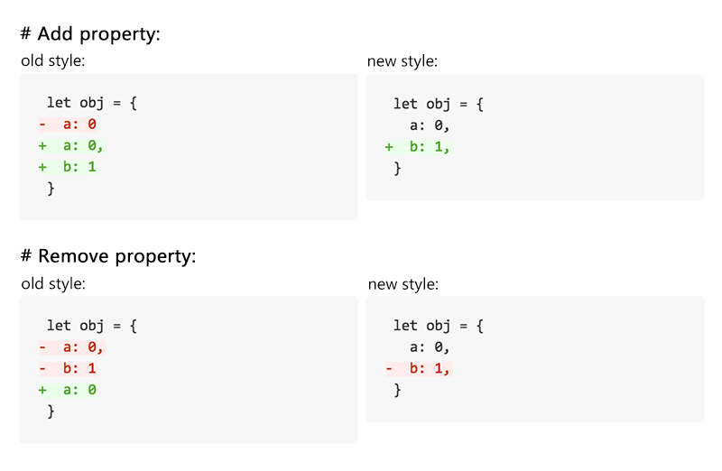

# 末尾的逗号

- template: post.html
- pubdate: 2015-08-10
- tags: Code, Style

----



<!--more-->

早期的 JavaScript 运行环境大都不支持末尾多出来的逗号，或者会抛出异常，或者不符合期望。

比如：

```js
var obj = {
  a: 0, // 抛出异常。
};

var arr = [
  0, // arr.length === 2
];
```

由于不支持尾逗号，我们以前写代码都需要手动去除尾逗号（工具最多提示你这里多了个逗号）。
因此我们增加、删除一个属性、数组项时，总是需要担心相邻项的逗号问题。

比如增加一项：

- 如果被增加项是列表的最后一项，则需要给前一项（原最后一项）添加一个逗号，但被添加项本身不添加逗号。
  - 新增一项本来并不需要修改前一项，但是在非尾逗号情况下则必须做这个无本质意义的修改。
  - 这很麻烦，也很容易导致错误。
  - 实际你只是增加了一项，但你在 diff 中会看到又是删除项，又是增加项。review 时你就需要关注这些无谓的变更。
- 如果被添加项不是列表的最后一项，则被添加项要加上逗号。

```diff
 var obj = {
-  a: 0
+  a: 0,
+  b: 1
 };

 var arr = [
-  0
+  0,
+  1
 ];
```

删除一项也是：

- 你本来只是要删除了最后一项，但你不得不修改前一项。麻烦，容易出问题。
- 你本来只是删除了一项，但在 diff 中也是看到又是删除，又是增加。

```diff
 var obj = {
-  a: 0,
-  b: 1
+  a: 0
 };

 var arr = [
-  0,
-  1
+  0
 ];
```

值得高兴的是，现在的 JavaScript 运行环境、预编译工具、语法检查工具都支持了尾逗号。
一旦我们统一使用尾逗号风格：

- 我们在增加或删除一项时，再也不需要关心相邻项了。
- diff 看起来也更直观清爽。

新增一项：

```diff
 var obj = {
   a: 0,
+  b: 1,
 };

 var arr = [
   0,
+  1,
 ];
```

删除一项：

```diff
 var obj = {
   a: 0,
-  b: 1,
 };

 var arr = [
   0,
-  1,
 ];
```

另外也有些语言是不需要逗号的，每一项都不需要。比如 Markdown 的列表，yml，yaml，
xml，html 等。

全要逗号，或者全不要逗号，他们的共同点就是**一致性**。这种一致性让书写和阅读都非常简洁清晰。
可维护性也更好。

你觉得呢？
